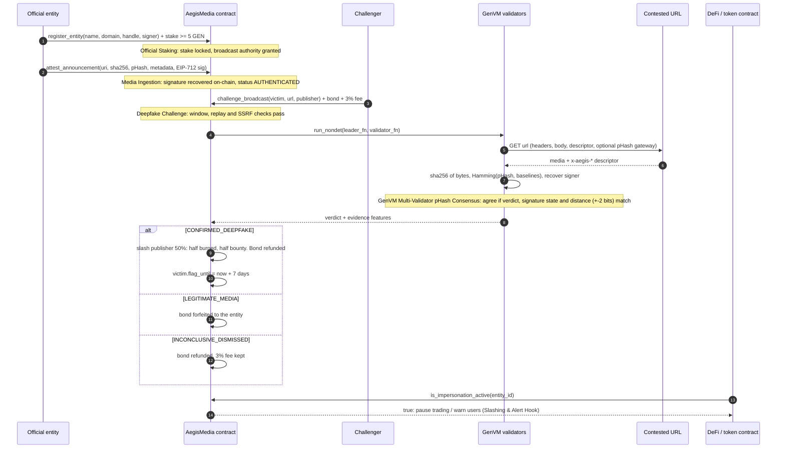

# AegisMedia

**An on-chain verifiable media registry and anti-impersonation circuit breaker, built on GenLayer (GenVM).**

Official entities (founders, foundations, DAOs) stake GEN to register a canonical identity and anchor announcements with a perceptual hash and an EIP-712 signature. Anyone can challenge a viral forgery with a bond. GenVM validators fetch the contested media independently, compare perceptual-hash distance, verify signatures and agree on a verdict through a custom equivalence validator. A confirmed deepfake slashes the publisher's stake (50% burned, 50% bounty to the challenger) and trips an on-chain `FLAGGED_IMPERSONATION` circuit breaker that DeFi and token contracts can read.

| Piece | Where |
|---|---|
| Intelligent contract | `contracts/aegis_media.py` |
| Direct-mode test suite (170+ tests) | `tests/direct/` |
| Dashboard (Next.js 14 + Tailwind, live mode only) | `frontend/` |
| Deploy / live verification | `scripts/deploy.py`, `scripts/verify_live.py` |

## Quick start

```bash
uv venv --python 3.12 && uv pip install --prerelease=allow -r requirements.txt

.venv/bin/genvm-lint check contracts/aegis_media.py     # 0 errors
.venv/bin/python -m pytest                              # direct-mode suite (~4 min)

.venv/bin/python scripts/deploy.py                      # deploy + seed + sync frontend
.venv/bin/python scripts/verify_live.py                 # live end-to-end checks

cd frontend && npm install && npm run dev               # http://localhost:3000
```

`deploy.py` generates throwaway keys into `.env` (gitignored) and funds them from the Studio faucet. It writes the contract address to `frontend/lib/deployment.json`, so the dashboard needs no further configuration. The dashboard has no mock layer: until a contract is deployed it says so instead of showing fake data.

## How it works



The same flow as ASCII:

```
Official Staking ──► Media Ingestion ──► Deepfake Challenge ──► GenVM Multi-Validator ──► Slashing &
 stake >= 5 GEN      sha256 + pHash       bond + 3% fee           pHash consensus          Alert Hook
 register identity   EIP-712 signature    URL fetched by every    Hamming distance,        50% burn / 50% bounty
                     verified on-chain    validator               signature, origin        is_impersonation_active()
```

### Roles in a challenge

- **Victim entity**: the identity the contested media claims to speak for. On a confirmed deepfake it is flagged `FLAGGED_IMPERSONATION` for 7 days. Downstream contracts read `is_impersonation_active(victim)`.
- **Publisher entity** (optional): the *staked* channel that posted the forgery. Its stake is slashed by `SLASH_BPS` (50% of its stake), split 50% burned and 50% bounty. If the impostor is unstaked or unknown (`publisher = 0`) there is nothing to slash; the bounty is instead paid from the arbitration-fee pool, capped at half the pool and at the bond.

### Verdicts

| Verdict | Condition | Economics |
|---|---|---|
| `CONFIRMED_DEEPFAKE` | Hamming distance > 10 bits against the signed or attested baseline, **or** the media claims the entity's identity with a forged or missing signature, **or** a valid signature is replayed over different bytes | Bond refunded, bounty paid, publisher slashed, victim flagged for 7 days |
| `LEGITIMATE_MEDIA` | Exact authentic bytes, valid signature with matching pHash (≤ 10 bits), served from the entity's own domain, or no identity claim at all | Bond forfeited to the entity, fee kept |
| `INCONCLUSIVE_DISMISSED` | URL unreachable, rate-limited (429), 4xx or 5xx | Bond refunded, 3% fee kept |

### Economics and solvency

| Constant | Value |
|---|---|
| Minimum entity stake | 5 GEN |
| Minimum challenge bond | 0.5 GEN (plus 3% non-refundable arbitration fee, so `msg.value >= 0.515 GEN`) |
| Slash / burn split | 50% of stake slashed; 50% of that burned, 50% bounty |
| Withdrawal cooldown | 7 days (stake stays slashable while pending) |
| Circuit breaker | 7 days per confirmed deepfake, renewed by further confirmations |
| Challenge window | A baseline must have been attested within 30 days (`ERR_CHALLENGE_EXPIRED` otherwise) |
| Hamming threshold | > 10 of 64 bits |

All value moves through a pull-pattern `claim_payout()`. `get_solvency()` exposes the invariant that the suite asserts after every economic scenario:

```
total_in == total_paid_out + entity_stakes + challenger_bonds + claimable + protocol_fees
```

`total_paid_out` includes burned value. `claimable` holds refunded bonds, bounties, awarded forfeits and stake returns.

### Cryptography without precompiles

The GenVM runner ships neither `ecrecover` nor `keccak256`, so `contracts/aegis_media.py` carries a pure-Python keccak-256 and secp256k1 public-key recovery (low-`s` enforced against malleability). The EIP-712 domain binds `chainId = 61997` and the verifying contract, so signatures cannot be replayed across chains or deployments. The test suite checks the on-chain digest against `eth_account` for every keccak block-boundary length.

## Evidence format

The validators read the contested URL for these fields, from `x-aegis-*` response headers or from a JSON body (top level or an `aegis` object):

`entity_id`, `content_uri`, `sha256`, `phash`, `metadata_digest`, `timestamp`, `signature`

The SHA-256 of the served bytes is always computed by the validators themselves. If the governor configures a **pHash gateway** (`set_phash_gateway`), each validator also asks `GET {gateway}?url=<contested>` for `{"phash": "<16 hex>"}`, which is the only source that can score re-encoded media.

## Game Theory, Perceptual Hashing Limits & Threat Model

### Incentives

- **Entities** lock stake they lose only if *their own channel* publishes a confirmed forgery. Honest entities pay nothing but opportunity cost.
- **Challengers** risk the 3% fee on every attempt and the whole bond on a false alarm, and earn a bounty only on a confirmed deepfake. Blind filing is negative-EV; a verifiable forgery is positive-EV. The bounty is bounded by the publisher's stake, so the bond must stay meaningfully below the stake of the targets worth hunting.
- **Forgers** with a stake lose half of it per confirmed incident. Unstaked forgers cannot be slashed. For them the protocol only offers detection, the 7-day alert and a capped bounty, not deterrence.

### Perceptual hashing limits

- A 64-bit pHash has a **collision/blind-spot trade-off**. Two unrelated images agree on about 32 bits, so a random collision inside 10 bits has probability about 2⁻²⁸ (the binomial tail of 64 bits at p = ½). Targeted attacks are far cheaper: an adversary can run gradient or hill-climb attacks to craft an image that is visually unrelated but within 10 bits of a baseline (a **second-preimage on a lossy hash**), and a deepfake that preserves global luminance structure (same scene, swapped face) can stay within threshold. **Hamming distance ≤ 10 means "perceptually similar", not "authentic".** Authenticity comes from the signature; pHash only handles re-encoding drift.
- The 10-bit threshold sits between benign drift (recompression, resize, mild crop usually move 0 to 6 bits) and edits (usually > 14). Between 7 and 14 bits is a grey zone where honest and malicious edits overlap. Lowering the threshold raises false-positive slashes of honest mirrors; raising it widens the adversary's forgery budget.
- pHash does not cover audio, heavy crops, rotations or mirrored frames. Video is hashed on a single frame by the dashboard, so frame-level edits elsewhere are invisible.
- **In-VM decoding is unavailable**, so a pHash must come from the descriptor or the gateway. Without a gateway, served bytes whose SHA-256 differs from the signed SHA-256 cannot be scored and are treated as an invalid signature binding, which means a lossless re-host passes and a re-encoded honest mirror needs the gateway to avoid a false deepfake verdict.

### Oracle latency and consensus risks

- Validators fetch the URL at different moments. Content that changes, geo-varies or is taken down mid-round yields leader/validator disagreement. The contract resolves this by comparing evidence features (reachability, signature state, verdict, distances within ±2 bits) rather than raw bytes, so benign drift reaches consensus and verdict flips across the threshold do not, which forces rotation to a new leader.
- An attacker who controls the contested origin can serve different content per client (**cloaking**) to split validators or hide the forgery from them. The result is an inconclusive or failed round (the challenge reverts), not a wrongful slash. Retries after the 1-hour inconclusive cooldown are allowed.
- A forger can **take the page down** before validators fetch it, turning a true positive into `INCONCLUSIVE_DISMISSED`. Challengers should snapshot first and challenge fast; the fee is the price of that race.
- Consensus on Studio Next takes minutes, so a viral forgery is live during the round. The circuit breaker engages only after the verdict.

### Other threats

| Threat | Mitigation / residual risk |
|---|---|
| Signature replay across chains, contracts or entities | EIP-712 domain with chain id and verifying contract; entity id is inside the signed struct |
| Attestation replay / backdating | ±window timestamp check, duplicate digest and per-entity duplicate content rejected |
| Signature malleability | Low-`s` only, `v` normalised |
| SSRF through contested or content URIs | Public `http(s)` hosts only; private, link-local, numeric-encoded, IPv6 and rebinding hosts rejected |
| Challenge replay and griefing | One conclusive adjudication per (entity, canonical URL); fee on every attempt; retry cooldown on inconclusive |
| Griefing with false challenges | Forfeited bond is awarded to the entity |
| Exit before slash | Withdrawal request does not shield stake; it stays slashable through the 7-day cooldown |
| Name squatting | Domain and handle are unique, but registration does not prove control of the domain. The governor `verified` badge is a curator signal, and downstream consumers should key on `entity_id` plus the badge |
| Compromised signing key | The attacker can sign valid announcements. The entity should rotate by re-registering; a self-slash path exists (`publisher == victim`) for the owner-initiated case |
| Governor trust | The governor can set the pHash gateway, mark entities verified and withdraw accrued fees. It cannot move stakes or bonds |

### Known limitations

- The identity-claim heuristic (name, domain or handle mentioned in the page text, or a signature present) is deliberately simple. Pages that impersonate without naming the entity are classified `LEGITIMATE_MEDIA`, which fails safe for the challenger's bond but not for users.
- The slash is a fixed 50% of stake, with no per-incident severity scaling.
- The burn is an asynchronous `emit_transfer` to `0x…dEaD`. If enqueueing fails, the value is retained as a protocol liability rather than lost.

## Testing

`tests/direct/` runs the contract in-memory with mocked web responses (headers, status codes, gateway) and covers: registration, stake accounting and cooldowns; EIP-712 verification (wrong key, wrong chain, wrong contract, altered fields, high-`s`, malformed); Hamming math and boundary cases; deepfake detection by forged signature, missing signature, copied signature over altered bytes and pHash divergence; bogus-challenge bond forfeiture; solvency after every flow; expired challenge windows and replays; and validator-side agreement, drift tolerance and rejection of forged leader verdicts.

```bash
.venv/bin/python -m pytest -q
.venv/bin/genvm-lint check contracts/aegis_media.py
```

## Frontend

`frontend/` is a Next.js 14 App Router app with Tailwind. It reads and writes the live contract through `genlayer-js` and an injected wallet.

- **Registry**: entity cards with stake, status and alert state, a detail drawer, and registration.
- **Verifier**: drop a file or paste a URL. SHA-256 and a 64-bit DCT pHash are computed in the browser; the page shows `AUTHENTICATED SEAL` or `UNVERIFIED`. Owners whose wallet is the registered signing key can sign and anchor the file.
- **Challenge terminal**: bond and fee calculator, a live consensus timeline, a Hamming-distance meter with a 64-bit comparison grid, and slash/bounty results.
- **Wallet**: injected wallet with automatic add/switch to Studio Next (`chainId 61997`), pull-payout button.

URL checks run in the browser, so cross-origin URLs that block CORS must be downloaded and uploaded instead.
