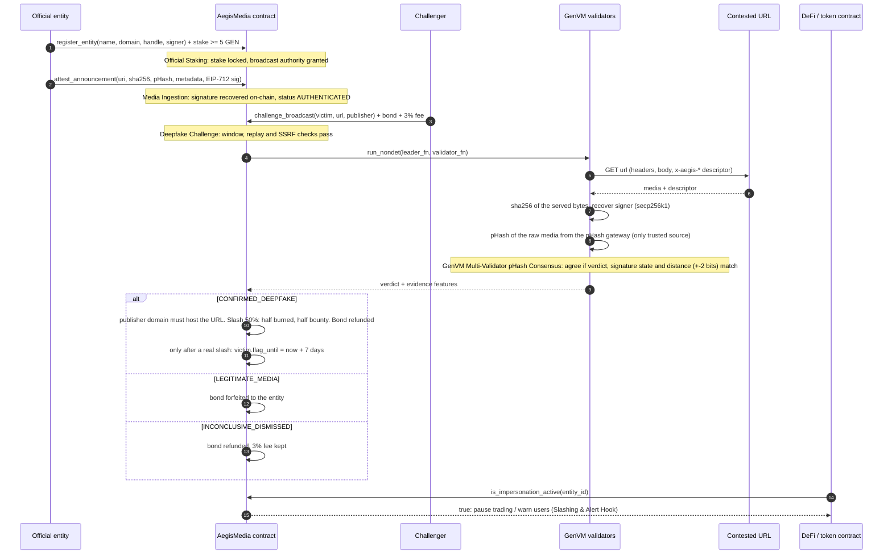

# AegisMedia

**An on-chain verifiable media registry and anti-impersonation circuit breaker, built on GenLayer (GenVM).**

Official entities (founders, foundations, DAOs) stake GEN to register a canonical identity and anchor announcements with a perceptual hash and an EIP-712 signature. Anyone can challenge a viral forgery with a bond. GenVM validators fetch the contested media independently, compare perceptual-hash distance, verify signatures and agree on a verdict through a custom equivalence validator. A confirmed deepfake slashes the publisher's stake (50% burned, 50% bounty to the challenger) and trips an on-chain `FLAGGED_IMPERSONATION` circuit breaker that DeFi and token contracts can read.

| Piece | Where |
|---|---|
| Intelligent contract | `contracts/aegis_media.py` |
| Direct-mode test suite | `tests/direct/` (includes the audit PoCs in `test_aegis_media.py`) |
| Dashboard (Next.js 14 + Tailwind, live mode only) | `frontend/` |
| Deploy / live verification | `scripts/deploy.py`, `scripts/verify_live.py` |

## Quick start

```bash
uv venv --python 3.12 && uv pip install --prerelease=allow -r requirements.txt

.venv/bin/genvm-lint check contracts/aegis_media.py     # 0 errors
.venv/bin/python -m pytest                              # direct-mode suite (~4 min)

.venv/bin/python -m scripts.deploy                      # deploy + seed + sync frontend
.venv/bin/python -m scripts.verify_live                 # live end-to-end checks

cd frontend && npm install && npm run dev               # http://localhost:3000
```

`deploy.py` generates throwaway keys into `.env` (gitignored) and funds them from the Studio faucet. It records the deployment in `deployments/studio-next.json` and syncs the address to `frontend/lib/deployment.json`, so the dashboard needs no further configuration. The dashboard has no mock layer: until a contract is deployed it says so instead of showing fake data.

## How it works



The same flow as ASCII:

```
Official Staking ──► Media Ingestion ──► Deepfake Challenge ──► GenVM Multi-Validator ──► Slashing &
 stake >= 5 GEN      sha256 + pHash       bond + 3% fee           pHash consensus          Alert Hook
 register identity   EIP-712 signature    URL fetched by every    Hamming distance,        50% burn / 50% bounty
                     verified on-chain    validator               signature, origin        is_impersonation_active()
```

### Roles in a challenge

- **Victim entity**: the identity the contested media claims to speak for. On a confirmed deepfake that slashed a staked publisher, it is flagged `FLAGGED_IMPERSONATION` for 7 days. Downstream contracts read `is_impersonation_active(victim)`.
- **Publisher entity** (optional, `0` when unknown): the registered entity the challenger accuses of hosting the forgery. **Domain binding is enforced**: the contested URL's host must equal the publisher's registered domain or be a subdomain of it, otherwise the call reverts with `ERR_PUBLISHER_MISMATCH` before any bond is taken. You cannot slash an entity for a URL it does not host. Its stake is slashed by `SLASH_BPS` (50%), split 50% burned and 50% bounty.
- **No publisher**: with `publisher = 0` a verdict is recorded and the bond refunded, but **there is no bounty and no flag**. A bounty is paid only out of a slashed stake; the fee pool never subsidises payouts.

### Verdicts

`CONFIRMED_DEEPFAKE` requires *explicit evidence of forgery*. A page that merely mentions an entity (a news article, a blog post, a tweet embed) is never a deepfake.

| Verdict | Condition | Economics |
|---|---|---|
| `CONFIRMED_DEEPFAKE` | (a) a signature that fails secp256k1 verification against the entity's registered key, **or** (b) a valid signature over media whose **independently computed** pHash diverges more than 10 bits from the signed pHash, **both only when the response carries an explicit `x-aegis-entity` header naming the entity**, **or** (c) unsigned media, hosted off the entity's domain, whose independently computed pHash is within 10 bits of official media | Bond refunded. If a staked, domain-bound publisher exists: it is slashed, the challenger gets half of the slash and the victim is flagged for 7 days |
| `LEGITIMATE_MEDIA` | Exact authentic bytes; a valid signature over the exact bytes served; a valid signature whose independently hashed media matches within 10 bits; the entity's own domain; independently hashed media unrelated to the baselines; or text with no forgery evidence | Bond forfeited to the entity, fee kept |
| `INCONCLUSIVE_DISMISSED` | URL unreachable, rate-limited, 4xx or 5xx; or **unmeasurable media** (a valid signature or media-like payload with no gateway, a JSON sidecar without a gateway), or **a signature with no explicit `x-aegis-entity` header claim** (`unclaimed_signature`) | Bond refunded, 3% fee kept |

### Economics and solvency

| Constant | Value |
|---|---|
| Minimum entity stake | 5 GEN |
| Minimum challenge bond | 0.5 GEN (plus 3% non-refundable arbitration fee, so `msg.value >= 0.515 GEN`) |
| Slash / burn split | 50% of stake slashed; 50% of that burned, 50% bounty |
| Withdrawal cooldown | 7 days (stake stays slashable while pending) |
| Circuit breaker | 7 days per confirmed deepfake, renewed by further confirmations |
| Challenge window | A baseline must have been attested within 30 days (`ERR_CHALLENGE_EXPIRED` otherwise) |
| Hamming threshold | > 10 of 64 bits |

All value moves through a pull-pattern `claim_payout()`. `get_solvency()` exposes the invariant that the suite asserts after every economic scenario:

```
total_in == total_paid_out + entity_stakes + challenger_bonds + claimable + protocol_fees
```

`total_paid_out` includes burned value. `claimable` holds refunded bonds, bounties, awarded forfeits and stake returns.

### Cryptography without precompiles

The GenVM runner ships neither `ecrecover` nor `keccak256`, so `contracts/aegis_media.py` carries a pure-Python keccak-256 and secp256k1 public-key recovery (low-`s` enforced against malleability). The EIP-712 domain binds `chainId = 61997` and the verifying contract, so signatures cannot be replayed across chains or deployments. The test suite checks the on-chain digest against `eth_account` for every keccak block-boundary length.

## Evidence format

The validators read the contested URL for these fields, from `x-aegis-*` response headers or from a JSON body (top level or an `aegis` object):

`entity_id`, `content_uri`, `sha256`, `phash`, `metadata_digest`, `timestamp`, `signature`, `media_uri`

What is trusted, and what is not:

| Source | Trusted as | Never trusted as |
|---|---|---|
| SHA-256 of the served bytes (computed by every validator) | exact-match evidence against attested digests | |
| secp256k1 recovery of the `signature` over the descriptor | proof the entity key signed that descriptor | proof that the *served media* is what was signed |
| `phash` in a header or JSON sidecar | the value the signature covers | a **measurement of the media**. It is origin-asserted |
| pHash returned by the configured gateway | the only independently computed perceptual hash | |

### Explicit identity claim

A signature found in a response is not, by itself, a claim that the host speaks for the entity. The contract only treats it as forgery evidence when the response carries an **`x-aegis-entity` HTTP response header naming the victim**. Response headers are set by the origin server, so only the host itself can make that claim; someone uploading a signed JSON file to a forum, bucket or IPFS gateway cannot set it. A signed file merely sitting on a domain is therefore `INCONCLUSIVE_DISMISSED` (`unclaimed_signature`), never a slash. A header naming a different entity is not a claim on the victim either.

### JSON sidecar and gateway limitation

A JSON sidecar describes media, it is not the media. The GenVM runner cannot decode images or video, so a validator cannot hash a sidecar's referenced media itself. Therefore:

- **With a gateway** (`set_phash_gateway`): validators ask `GET {gateway}?url=<media_uri>` (the sidecar's `media_uri`, SSRF-checked) and compare the gateway's pHash to the signed one.
- **Without a gateway, or without a safe `media_uri`**: a sidecar can only produce `INCONCLUSIVE_DISMISSED` (or `CONFIRMED_DEEPFAKE` when its signature is forged, since that needs no media measurement). It is never `LEGITIMATE_MEDIA`, because wrapping fake media in a sidecar with a genuine signature and an authentic-looking pHash would otherwise buy an unearned legitimacy verdict.

**No gateway is configured at deployment, and perceptual hashing is therefore disabled until the governor sets one with `set_phash_gateway`.** Without a gateway the contract falls back to exact-byte matches and signature checks only, and every case that would need a perceptual measurement (valid signature over re-encoded or sidecar-referenced media, unsigned look-alike media) resolves to `INCONCLUSIVE_DISMISSED`: bond refunded, 3% fee kept, nobody slashed. A missing gateway never produces a slash or a legitimacy verdict.

## Game Theory, Perceptual Hashing Limits & Threat Model

### Incentives

- **Entities** lock stake they lose only if *their own channel* publishes a confirmed forgery. Honest entities pay nothing but opportunity cost.
- **Challengers** risk the 3% fee on every attempt and the whole bond on a false alarm, and earn a bounty only on a confirmed deepfake. Blind filing is negative-EV; a verifiable forgery is positive-EV. The bounty is bounded by the publisher's stake, so the bond must stay meaningfully below the stake of the targets worth hunting.
- **Forgers** with a stake lose half of it per confirmed incident. Unstaked forgers cannot be slashed. For them the protocol only offers detection, the 7-day alert and a capped bounty, not deterrence.

### Perceptual hashing limits

- A 64-bit pHash has a **collision/blind-spot trade-off**. Two unrelated images agree on about 32 bits, so a random collision inside 10 bits has probability about 2⁻²⁸ (the binomial tail of 64 bits at p = ½). Targeted attacks are far cheaper: an adversary can run gradient or hill-climb attacks to craft an image that is visually unrelated but within 10 bits of a baseline (a **second-preimage on a lossy hash**), and a deepfake that preserves global luminance structure (same scene, swapped face) can stay within threshold. **Hamming distance ≤ 10 means "perceptually similar", not "authentic".** Authenticity comes from the signature; pHash only handles re-encoding drift.
- The 10-bit threshold sits between benign drift (recompression, resize, mild crop usually move 0 to 6 bits) and edits (usually > 14). Between 7 and 14 bits is a grey zone where honest and malicious edits overlap. Lowering the threshold raises false-positive slashes of honest mirrors; raising it widens the adversary's forgery budget.
- pHash does not cover audio, heavy crops, rotations or mirrored frames. Video is hashed on a single frame by the dashboard, so frame-level edits elsewhere are invisible.
- **In-VM decoding is unavailable**, so the only trusted pHash is the gateway's. Without a gateway, media that is not byte-identical to an attested file or to the bytes a valid signature covers is `INCONCLUSIVE_DISMISSED`, never a slash and never a legitimacy verdict. An unsigned recompression of official media (verdict (c)) is a deepfake only when the gateway measures it, and honest unsigned re-posts of official images are exposed to that rule by design.

### Oracle latency and consensus risks

- Validators fetch the URL at different moments. Content that changes, geo-varies or is taken down mid-round yields leader/validator disagreement. The contract resolves this by comparing evidence features (reachability, signature state, verdict, distances within ±2 bits) rather than raw bytes, so benign drift reaches consensus and verdict flips across the threshold do not, which forces rotation to a new leader.
- An attacker who controls the contested origin can serve different content per client (**cloaking**) to split validators or hide the forgery from them. The result is an inconclusive or failed round (the challenge reverts), not a wrongful slash. Retries after the 1-hour inconclusive cooldown are allowed.
- A forger can **take the page down** before validators fetch it, turning a true positive into `INCONCLUSIVE_DISMISSED`. Challengers should snapshot first and challenge fast; the fee is the price of that race.
- Consensus on Studio Next takes minutes, so a viral forgery is live during the round. The circuit breaker engages only after the verdict.

### Audit hardening

| Finding | Attack | Fix |
|---|---|---|
| Arbitrary publisher slashing | Name an innocent entity as `publisher` for any URL | The URL must be hosted on the publisher's registered domain (exact or subdomain), else revert |
| News-article circuit-breaker DDoS | File real news articles that mention the entity; 0.015 GEN flags it for 7 days | A text mention is never evidence. Deepfake needs a forged signature or independently hashed media. The breaker trips only after a **real slash** of a staked, domain-bound publisher, so planting forgery evidence on a page you control (a junk signature) costs you your own stake |
| JSON sidecar bypass | Wrap fake media in a sidecar with a valid signature and an authentic pHash | Origin-asserted pHashes are never trusted; no gateway means `INCONCLUSIVE_DISMISSED` |
| Slashing a host for a stranger's signed file (UGC) | Upload a signed JSON to a forum or gateway on an entity's domain, then challenge that URL | Signature-based deepfake verdicts require an explicit `x-aegis-entity` response header, which uploaders cannot set; otherwise `INCONCLUSIVE_DISMISSED` |
| Fee pool drain | `publisher = 0` paid a bounty out of accumulated fees | Bounties come only from slashed stake; the fee pool only ever grows |

Residual cost to flag a victim: an attacker must register a staked entity (5 GEN minimum), host a forgery on its domain and lose half its stake, 25% of which is burned for good, to hold the breaker for 7 days. That is a deliberate price, not zero.

### Other threats

| Threat | Mitigation / residual risk |
|---|---|
| Signature replay across chains, contracts or entities | EIP-712 domain with chain id and verifying contract; entity id is inside the signed struct |
| Attestation replay / backdating | ±window timestamp check, duplicate digest and per-entity duplicate content rejected |
| Signature malleability | Low-`s` only, `v` normalised |
| SSRF through contested or content URIs | Public `http(s)` hosts only; private, link-local, numeric-encoded, IPv6 and rebinding hosts rejected |
| Challenge replay and griefing | One conclusive adjudication per (entity, canonical URL); fee on every attempt; retry cooldown on inconclusive |
| Griefing with false challenges | Forfeited bond is awarded to the entity |
| Exit before slash | Withdrawal request does not shield stake; it stays slashable through the 7-day cooldown |
| Name squatting | Domain and handle are unique, but registration does not prove control of the domain. The governor `verified` badge is a curator signal, and downstream consumers should key on `entity_id` plus the badge |
| Compromised signing key | The attacker can sign valid announcements. The entity should rotate by re-registering; a self-slash path exists (`publisher == victim`) for the owner-initiated case |
| Governor trust | The governor can set the pHash gateway, mark entities verified and withdraw accrued fees. It cannot move stakes or bonds |

### Known limitations

- **User-Generated Content (UGC):** Entities are strictly responsible for content hosted on their registered domains. If an entity allows arbitrary uploads (e.g., a forum or IPFS gateway) and a malicious signed JSON is hosted there, they are liable for slashing. The explicit-claim rule (`x-aegis-entity` header) protects a host from files it did not itself vouch for, but a host whose server serves that header on user-controlled content, or whose own pages are forged, is liable. Entities that accept uploads should register a separate domain for the registry channel and serve user content elsewhere.
- **Stake is required to be slashed, and to trip the breaker.** An attacker or impersonator *without* a registered stake cannot be slashed and cannot trigger the circuit breaker. The protocol records the verdict and refunds the bond, nothing more. The breaker protects against registered entities going rogue or being impersonated by other registered publishers; it is not a general alarm for anonymous forgers.
- **Perceptual hashing needs a gateway.** With no gateway set at deployment, only exact-byte and signature checks work and everything else is `INCONCLUSIVE_DISMISSED` (see above).
- Pages that impersonate an entity in plain text (a fake announcement as HTML or a tweet) carry no cryptographic or perceptual evidence and are classified `LEGITIMATE_MEDIA`. The protocol authenticates media and signatures, not prose. This fails safe against griefing and unsafe for users reading forged text.
- An unstaked impersonator (`publisher = 0`) can be recorded as a deepfake but cannot be slashed or trip the breaker. The breaker needs a staked, domain-bound publisher by design.
- The slash is a fixed 50% of stake, with no per-incident severity scaling.
- The burn is an asynchronous `emit_transfer` to `0x…dEaD`. If enqueueing fails, the value is retained as a protocol liability rather than lost.

## Testing

`tests/direct/` runs the contract in-memory with mocked web responses (headers, status codes, gateway) and covers: registration, stake accounting and cooldowns; EIP-712 verification (wrong key, wrong chain, wrong contract, altered fields, high-`s`, malformed); Hamming math and boundary cases; deepfake detection by forged signature, missing signature, copied signature over altered bytes and pHash divergence; bogus-challenge bond forfeiture; solvency after every flow; expired challenge windows and replays; and validator-side agreement, drift tolerance and rejection of forged leader verdicts.

```bash
.venv/bin/python -m pytest -q
.venv/bin/genvm-lint check contracts/aegis_media.py
```

## Frontend

`frontend/` is a Next.js 14 App Router app with Tailwind. It reads and writes the live contract through `genlayer-js` and an injected wallet.

- **Registry**: entity cards with stake, status and alert state, a detail drawer, and registration.
- **Verifier**: drop a file or paste a URL. SHA-256 and a 64-bit DCT pHash are computed in the browser; the page shows `AUTHENTICATED SEAL` or `UNVERIFIED`. Owners whose wallet is the registered signing key can sign and anchor the file.
- **Challenge terminal**: bond and fee calculator, a live consensus timeline, a Hamming-distance meter with a 64-bit comparison grid, and slash/bounty results.
- **Wallet**: injected wallet with automatic add/switch to Studio Next (`chainId 61997`), pull-payout button.

URL checks run in the browser, so cross-origin URLs that block CORS must be downloaded and uploaded instead.
